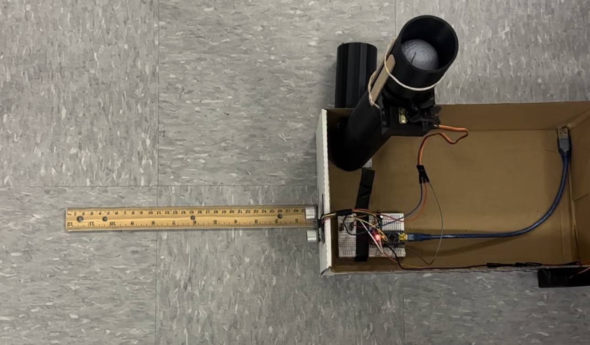
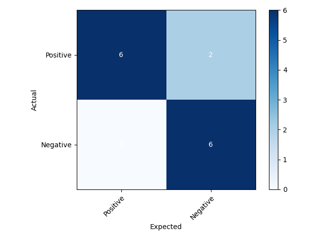
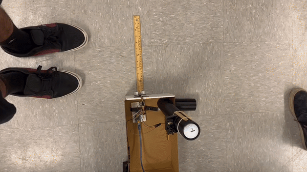
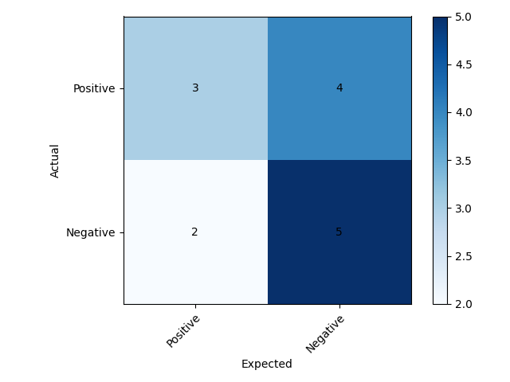
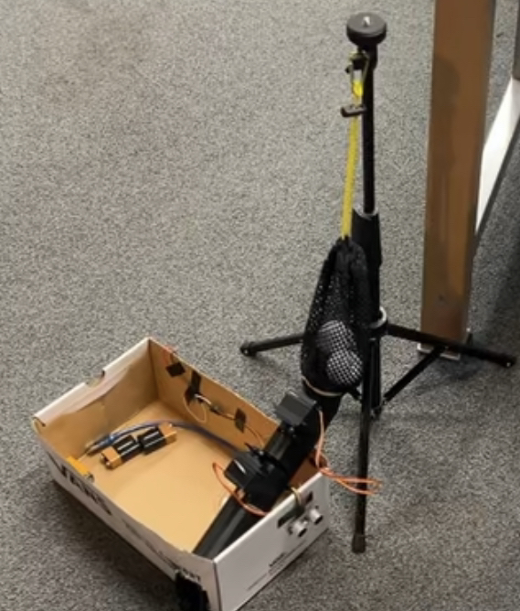
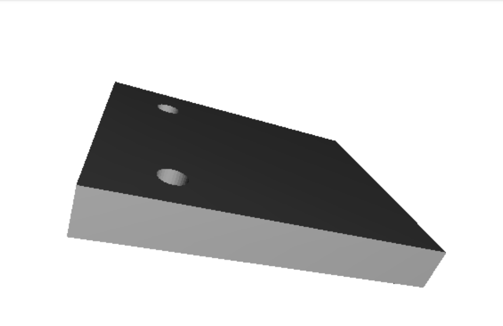
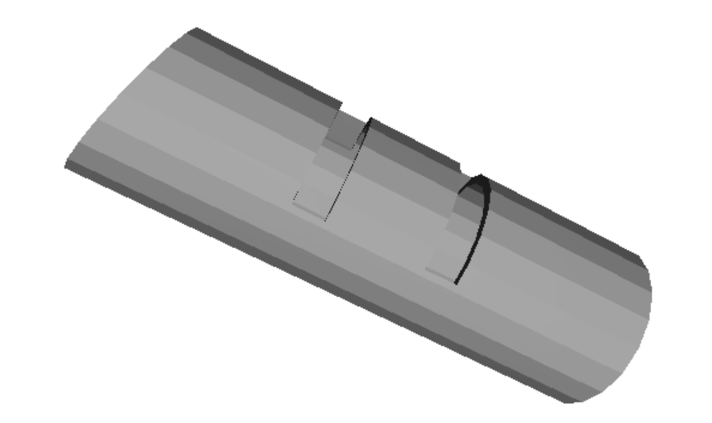
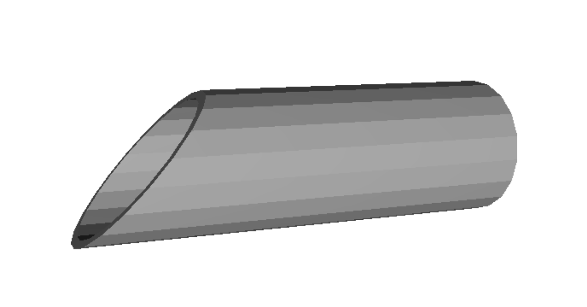
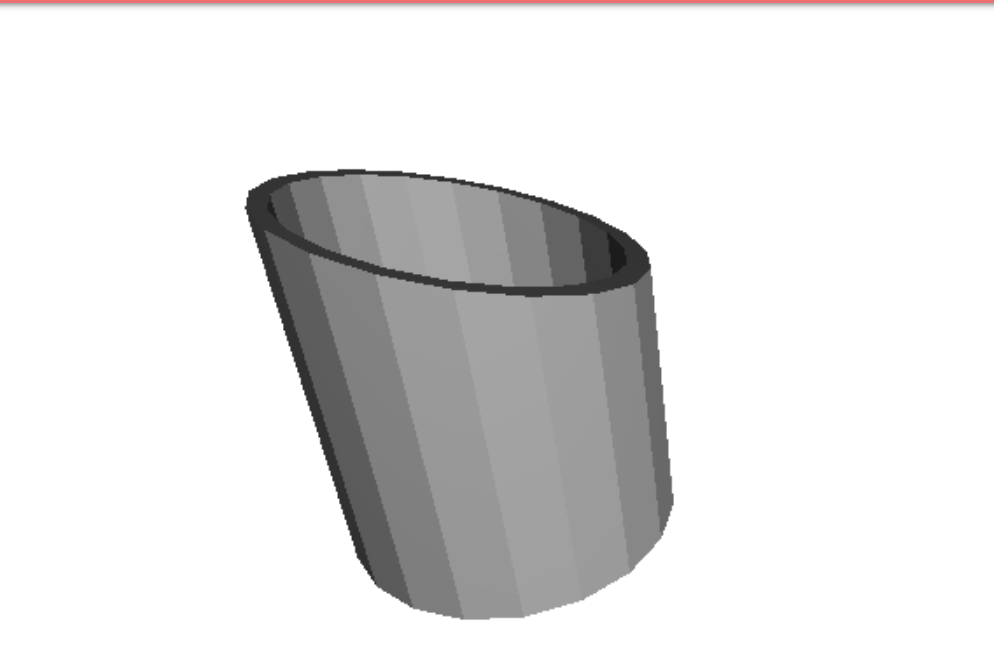
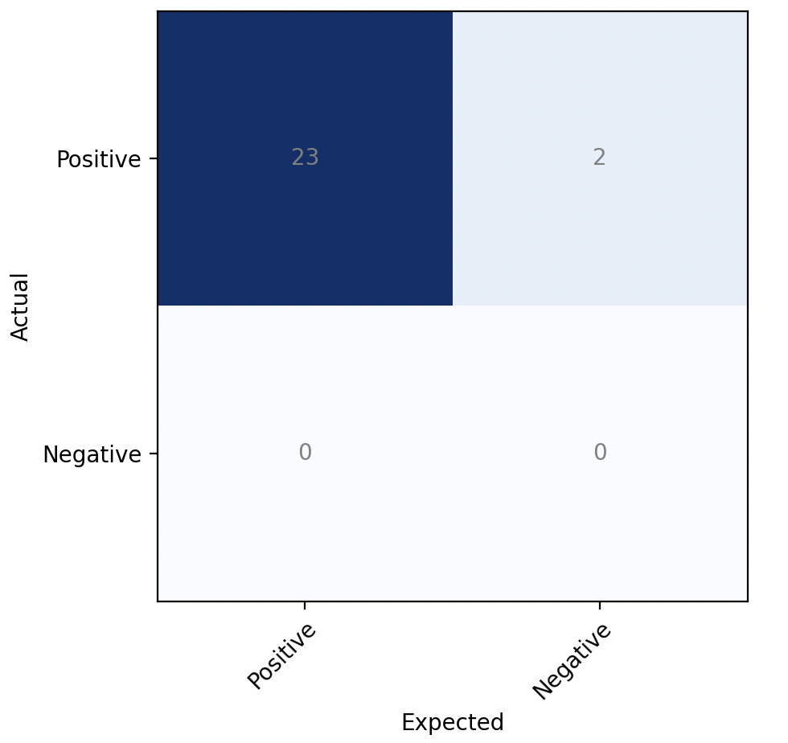

# ECE16 HW6 Report

Prepared by: Evan Lewis, Dominique Hernandez, Ali Hussain Date: 06/11/2023

## Challenge 1: Customer Feedback + User Observation

Our first "iteration" (considered Beta version as it barely satisfied golf ball dispensing and portability) Andy (our customer) noted that although the system was interesting, it had a lot of room for improvement:  
  
At the beginning of the week, we showed Andy this video as our prototype was not stable/secured enough for Andy to consistently test it. It was evident that this actuator would not work every time in dispensing the golf ball, let alone multiple golf balls. 

For our first official iteration, we made a drastic change from actuators to servos:  
  
We would also end up changing the box and setup for the rest of the system:  
 
Instead of using a half cut PVC pipe as shown in our beta design, we replaced it with our own 3D-designed and printed pipe, with a connector piece to dispense it. Our system here is also far more secure; the pipe is super glued to the walls of the box, and the wiring, battery are all secured to the walls of the box. 

We had Andy test our first iteration sprint. The requirements that this version achieved was that the dispensing mechanism was succesful and since the system is all in a box, it achieves Andy's desire of a portable system. Andy noticed the significant improvement of the system as he tested it:  
 

For our second iteration (multiple golf ball dispensing), the system unfortunately broke down mid-testing, and thus, we did not obtain any true positives. Just as we believed, Andy thought that the sudden drop would prove to be too much force for the servo attachment to withstand, and thus, the pipe should be at a more horizontal slope. This is addressed in our final iteration and we meet Andy's requirements as shown in the demo video in challenge 3.

## Challenge 2: System Characterization of Measurable Metrics
For our first iteration (single golf ball dispensing), we realized 4 critical aspects of the design:
<ul>
<li> The smallest distance where the sensor will not detect an object is around 5-6 inches.
<li> The user should horizontally motion (left to right) the golf club across the ultrasonic sensor, rather than vertically (up and down).
<li> The ultrasonic sensor can detect quick motions as long as it is horizontal and within the detecting distance. 
</ul>

Here are some instances of our iteration 1 tests:  
 
The gif above shows succesful dispensing when nearby object is detected. 
 
The gif above shows that the sensor does not detect object that are farther than 5-6 inches. 
 
The gif above shows that the sensor can detect quick horizontal motions that are within the distance threshold. 

The results of our first iteration through 14 trials are illustrated by the confusion matrix below:  
 
We were successful in achieving our initial checkpoint of consistent, singular golf ball disepnsing with 86% accuracy.  
Precision = TP / (TP + FP) = 1   
Recall = TP / (TP + FN) = 0.75  

For our second iteration, we 3D-designed an additional smaller pipe attached at the very top (this is shown in the iteration 1 testing videos but was not officially part of our first iteration) to hold 2 golf balls and test individual dispensing. We also changed our code slightly to adjust the initial and final positions of the servo as well as decreasing the delay between rotations. This was to ensure the servo was quick enough to let one golf ball go through but immediately go into a blocking state to prevent the other from dispensing. However, we did go through some trouble:  
  
The gif above shows that the servo would be too fast to even let one golf ball go through. However, there were some attempts that were successful:  
  

Our second checkpoint was somewhat functional and inconsistent, and our results are illustrated by the confusion matrix below:   
  
Precision = TP / (TP + FP) = 0.6  
Recall = TP / (TP + FN) = 0.43  

Iteration 3: Successful Multiple Golf Ball Dispensing  

## Challenge 3: Final Prototype Demo 

This is our final prototype:  
  

<b> Summary of system: </b> When a nearby object is detected by the ultrasonic sensor, the top servo will rotate away from the pipe allowing a golf ball to go through. However, the bottom servo is close enough to the top servo where only a singular golf ball can fit in between them. The top servo will then rotate back into its original place. Then, the bottom servo will rotate away from the pipe and allow the golf ball to go through, being released to the ground. The bottom servo will then rotate back into its original position, and this is the default state of our system. The tripod holds the mesh bag, and the mesh bag stores the golf balls, where the connector pipe connects between the pipe with the servos and the mesh bag allowing transportation. The circuitry and wiring is inside the box, and the batttery and sensor are on the outer walls of the box. The user must setup the tripod with the mesh bag and fill the bag up with golf balls themselves, which will both be originally inside the box to optimize portability. 

These are the materials we used:  <ul>
<li> 2x servos 
<li> 3D designed pipes
<li> Ultrasonic sensor
<li> Shoe box
<li> Golf ball mesh bag
<li> Tripod
<li> 9V Battery
<li> 3x capacitors (to generate current through servos)

These are our 3D designed pieces:
  
This piece is attached to the servos to trigger the blocking/release mechanism.
 
This piece has gaps where the servos' blocking attachment goes through, and the servos are directly attached to the outer walls of the print. The distance between the two gaps is identical to the diameter of a single golf ball. This is an intentional design to ensure that only one golf ball will always be dispensed every time a nearby object is detected.
  
 
The two pieces above are connectors that help reduce the momentum of the falling golf ball from the mesh bag.

We have 2 demo videos, where we test our solution and our customer, Andy, tests the system.

Our testing: 
  
Customer testing:  
 
In the video above, Andy is shown using his foot as the nearby object. Although it is a bit hard to see, the motor closest to the mesh bag rotates allowing one golf ball to go through, and then rotates back to its original position. Then, the second servo (closest to the end of the pipe) rotates allowing the golf ball to go through onto the ground. However, there were rare bugs as shown in the video where Andy has to sway his foot multiple times for the sensor to detect the nearby object. Furthermore, the golf balls will occasionally get stuck in the mesh bag and require a little push into the pipe, as shown in our own testing video.
</ul>

Here are our results:  
  
<b> Precision</b>: 1  
<b>Recall</b>: 0.88  
Our system met the customer's needs of a portable golf ball dispensing machine. As desired, when Andy will have his golf club near the sensor (in the demo he uses his foot) a golf ball will dispense. We did go through some challenges/limitations; golf balls getting stuck in the mesh bag, golf ball rarely getting stuck in the pipe, sensor taking too long to register nearby object, and trying to stabilize our system so that the sensor does not point at the ground and the pipe does not wiggle around. 